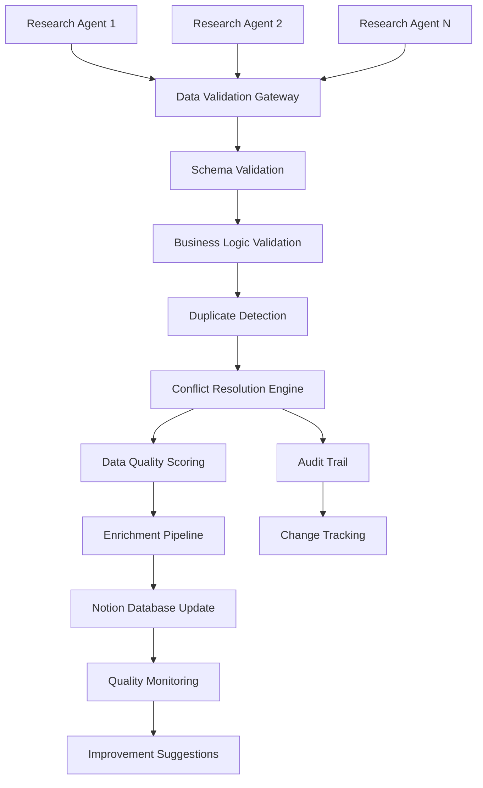

# 🔧 Data Pipeline Automation Specifications
*BC AI Ecosystem Atlas - Research Agent Integration & Quality Assurance*

**Version**: 1.0  
**Created**: January 28, 2025  
**Status**: ✅ Phase 2 Complete

---

## 🎯 **Pipeline Overview**

### Automation Goals
- **Research Agent Integration**: Seamless data ingestion from multiple research agents
- **Quality Assurance**: Automated validation, scoring, and improvement suggestions
- **Conflict Resolution**: Intelligent handling of conflicting data from multiple sources
- **Real-time Processing**: Sub-second data validation and integration
- **Audit Trails**: Complete attribution and change tracking

### Data Flow Architecture


---

## 🤖 **1. Research Agent Integration**

### 1.1 Standardized Data Format

#### Agent Submission Schema
```typescript
interface AgentSubmission {
  // Metadata
  submission: {
    agent_id: string;              // Unique agent identifier
    agent_version: string;         // Agent software version
    submission_timestamp: string;  // ISO 8601 timestamp
    confidence_score: number;      // 0-100 confidence in data accuracy
    data_sources: string[];        // URLs or reference sources
    processing_time_ms: number;    // Time taken to research
  };
  
  // Organization data
  organization: {
    // Required fields
    name: string;
    website?: string;
    
    // Geographic information
    location: {
      city?: string;
      province?: string;
      country?: string;
      address?: string;
      coordinates?: {
        lat: number;
        lng: number;
        source: 'geocoded' | 'manual' | 'approximate';
      };
    };
    
    // Classification
    classification: {
      category?: OrganizationCategory;
      ai_focus_areas?: AIFocusArea[];
      size?: OrganizationSize;
      year_founded?: number;
    };
    
    // Contact information
    contact?: {
      email?: string;
      phone?: string;
      linkedin?: string;
      primary_contact?: string;
      key_people?: string[];
    };
    
    // Business information
    business?: {
      short_blurb?: string;
      notable_projects?: string;
      funding_info?: string;
      status?: 'active' | 'acquired' | 'ceased' | 'unknown';
    };
  };
  
  // Research metadata
  research: {
    methodology: string;           // How data was collected
    verification_level: 'high' | 'medium' | 'low';
    last_verified: string;         // ISO 8601 timestamp
    notes?: string;                // Additional research notes
  };
}
```

#### API Endpoint for Agent Submissions
```typescript
// POST /api/v1/agents/submit
interface AgentSubmissionEndpoint {
  authentication: {
    method: 'api_key',
    header: 'X-Agent-API-Key',
    rate_limiting: {
      requests_per_minute: 30,
      burst_capacity: 50
    }
  };
  
  request_body: AgentSubmission;
  
  response: {
    submission_id: string;
    status: 'accepted' | 'validation_failed' | 'duplicate_detected';
    validation_errors?: ValidationError[];
    processing_eta?: number; // seconds
    conflict_resolution_required?: boolean;
  };
}

interface ValidationError {
  field: string;
  error_code: string;
  message: string;
  suggestion?: string;
}
```

### 1.2 Validation Middleware

#### Schema Validation Layer
```typescript
interface SchemaValidation {
  // Required field validation
  required_fields: {
    organization_name: {
      min_length: 2,
      max_length: 255,
      pattern: /^[a-zA-Z0-9\s\-&.,()]+$/,
      blacklisted_words: ['test', 'example', 'unknown']
    },
    
    website: {
      format: 'url',
      required_protocols: ['http', 'https'],
      validate_accessibility: true,
      timeout_ms: 5000
    }
  };
  
  // Data type validation
  type_validation: {
    coordinates: {
      lat: { min: 48.0, max: 60.0 }, // BC boundaries
      lng: { min: -139.0, max: -114.0 }
    },
    
    year_founded: {
      min: 1800,
      max: new Date().getFullYear(),
      must_be_realistic: true
    },
    
    confidence_score: {
      min: 0,
      max: 100,
      type: 'integer'
    }
  };
  
  // Business logic validation
  business_rules: {
    bc_location_required: true,
    ai_focus_required: true,
    website_accessibility_check: true,
    duplicate_name_tolerance: 0.85 // Levenshtein similarity
  };
}
```

#### Real-time Validation Pipeline
```typescript
interface ValidationPipeline {
  stages: [
    {
      name: 'schema_validation',
      timeout_ms: 1000,
      error_handling: 'fail_fast'
    },
    {
      name: 'business_logic_validation',
      timeout_ms: 3000,
      error_handling: 'collect_all_errors'
    },
    {
      name: 'external_verification',
      timeout_ms: 10000,
      error_handling: 'warn_on_failure',
      parallel_checks: [
        'website_accessibility',
        'linkedin_profile_validation',
        'geocoding_verification'
      ]
    }
  ];
  
  validation_results: {
    overall_score: number; // 0-100
    field_scores: Record<string, number>;
    errors: ValidationError[];
    warnings: ValidationWarning[];
    suggestions: ImprovementSuggestion[];
  };
}
```

### 1.3 Conflict Resolution Engine

#### Multi-Agent Conflict Detection
```typescript
interface ConflictResolution {
  // Conflict detection algorithms
  detection: {
    name_similarity: {
      algorithm: 'levenshtein_distance',
      threshold: 0.9,
      fuzzy_matching: true
    },
    
    location_proximity: {
      algorithm: 'haversine_distance',
      threshold_km: 5,
      address_normalization: true
    },
    
    business_overlap: {
      website_matching: 'exact',
      linkedin_matching: 'exact',
      email_domain_matching: true
    }
  };
  
  // Resolution strategies
  resolution_strategies: {
    highest_confidence: {
      description: 'Use data from agent with highest confidence score',
      applicable_when: 'confidence_difference > 20'
    },
    
    most_recent: {
      description: 'Use most recently submitted data',
      applicable_when: 'timestamps_within_24h'
    },
    
    field_level_merge: {
      description: 'Merge fields based on individual field confidence',
      strategy: 'pick_best_per_field'
    },
    
    human_review: {
      description: 'Flag for manual review',
      trigger_conditions: [
        'confidence_difference < 10',
        'conflicting_critical_fields',
        'potential_duplicate_organizations'
      ]
    }
  };
  
  // Conflict resolution workflow
  workflow: {
    automatic_resolution_threshold: 0.8,
    human_review_queue: true,
    conflict_history_tracking: true,
    resolution_audit_trail: true
  };
}
```

#### Automated Conflict Resolution
```typescript
interface AutomatedResolution {
  field_resolution_rules: {
    name: 'highest_confidence_wins',
    website: 'most_specific_url', // prefer specific pages over homepages
    coordinates: 'highest_accuracy', // ROOFTOP > RANGE_INTERPOLATED
    year_founded: 'earliest_reliable_source',
    contact_info: 'merge_non_conflicting',
    ai_focus_areas: 'union_of_all_sources'
  };
  
  confidence_weighting: {
    agent_track_record: 0.3,    // Historical accuracy
    data_freshness: 0.2,        // How recent the research is
    source_credibility: 0.3,    // Quality of sources cited
    verification_level: 0.2     // Level of verification performed
  };
  
  resolution_outcomes: {
    auto_resolved: {
      action: 'update_database',
      notification: 'log_only'
    },
    
    manual_review_required: {
      action: 'create_review_ticket',
      notification: 'slack_alert',
      priority: 'normal'
    },
    
    critical_conflict: {
      action: 'pause_processing',
      notification: 'immediate_alert',
      priority: 'high'
    }
  };
}
```

---

## 📊 **2. Quality Assurance Automation**

### 2.1 Automated Completeness Scoring

#### Completeness Algorithm
```typescript
interface CompletenessScoring {
  field_weights: {
    // Core identification (40%)
    name: 15,
    website: 15,
    category: 10,
    
    // Geographic information (20%)
    coordinates: 10,
    bc_region: 5,
    city: 5,
    
    // Contact information (20%)
    email: 8,
    linkedin: 7,
    primary_contact: 5,
    
    // Business information (20%)
    ai_focus_areas: 8,
    short_blurb: 7,
    year_founded: 5
  };
  
  scoring_rules: {
    // Field presence scoring
    present: 100,
    missing: 0,
    partial: 50, // e.g., incomplete contact info
    
    // Quality modifiers
    verified_data: '+10',
    recent_update: '+5',
    multiple_sources: '+5',
    outdated_data: '-10',
    low_confidence: '-5'
  };
  
  overall_score_calculation: {
    weighted_average: 'sum(field_score * weight) / sum(weights)',
    quality_bonus: 'verified_sources + recent_updates',
    penalty_factors: 'outdated_data + low_confidence',
    final_score: 'min(100, max(0, weighted_average + bonus - penalties))'
  };
}
```

#### Real-time Quality Monitoring
```typescript
interface QualityMonitoring {
  // Individual organization monitoring
  organization_quality: {
    score_thresholds: {
      excellent: 90,
      good: 70,
      needs_improvement: 50,
      poor: 30
    },
    
    trend_analysis: {
      track_score_changes: true,
      alert_on_decline: true,
      improvement_tracking: true
    }
  };
  
  // Database-wide quality metrics
  ecosystem_quality: {
    overall_completion_rate: 'avg(all_organization_scores)',
    completion_by_category: 'avg_score_per_category',
    completion_by_region: 'avg_score_per_region',
    quality_distribution: 'histogram_of_scores'
  };
  
  // Quality degradation alerts
  alerting: {
    score_drop_threshold: 10, // Alert if score drops by 10+ points
    batch_quality_issues: true, // Alert if many orgs have issues
    data_source_problems: true // Alert if specific agent has issues
  };
}
```

### 2.2 Advanced Duplicate Detection

#### Multi-Stage Duplicate Detection
```typescript
interface DuplicateDetection {
  // Stage 1: Exact matches
  exact_matching: {
    fields: ['website', 'linkedin', 'email'],
    preprocessing: 'normalize_urls_and_emails',
    match_threshold: 1.0
  };
  
  // Stage 2: Fuzzy name matching
  fuzzy_name_matching: {
    algorithm: 'jaro_winkler',
    threshold: 0.9,
    preprocessing: [
      'remove_legal_suffixes', // Inc., Ltd., Corp.
      'normalize_spacing',
      'handle_abbreviations',   // AI -> Artificial Intelligence
      'remove_stop_words'       // "The", "Inc"
    ]
  };
  
  // Stage 3: Location-based clustering
  location_clustering: {
    primary: 'address_normalization',
    fallback: 'coordinate_proximity',
    threshold_meters: 100,
    city_normalization: true
  };
  
  // Stage 4: Business profile similarity
  business_similarity: {
    ai_focus_areas: {
      similarity_metric: 'jaccard_index',
      threshold: 0.7
    },
    
    description_similarity: {
      algorithm: 'sentence_transformers',
      embedding_model: 'all-MiniLM-L6-v2',
      threshold: 0.8
    },
    
    key_people_overlap: {
      name_matching: 'fuzzy',
      threshold: 0.6
    }
  };
}
```

#### Intelligent Merging Strategy
```typescript
interface MergingStrategy {
  // Data priority rules
  data_prioritization: {
    most_complete_profile: 0.4,
    highest_confidence_source: 0.3,
    most_recent_data: 0.2,
    verified_status: 0.1
  };
  
  // Field-specific merge rules
  field_merge_rules: {
    name: 'choose_most_official', // prefer legal names
    website: 'choose_primary_domain',
    coordinates: 'choose_highest_precision',
    contact_info: 'merge_all_unique_contacts',
    ai_focus_areas: 'union_with_deduplication',
    descriptions: 'choose_most_comprehensive'
  };
  
  // Merge validation
  post_merge_validation: {
    consistency_check: true,
    completeness_improvement: true,
    business_logic_validation: true,
    conflict_flagging: true
  };
  
  // Audit trail
  merge_documentation: {
    original_records: 'preserve_in_archive',
    merge_rationale: 'document_decision_process',
    data_sources: 'track_all_contributing_sources',
    reviewer_approval: 'required_for_high_impact_merges'
  };
}
```

### 2.3 Data Consistency Checks

#### Cross-Field Validation
```typescript
interface ConsistencyChecks {
  // Geographic consistency
  geographic: {
    coordinates_vs_city: {
      description: 'Verify coordinates match stated city',
      tolerance_km: 50,
      action_on_mismatch: 'flag_for_review'
    },
    
    bc_region_accuracy: {
      description: 'Ensure BC region matches coordinates',
      region_boundaries: 'use_official_boundaries',
      action_on_mismatch: 'auto_correct_region'
    }
  };
  
  // Business logic consistency
  business_logic: {
    founding_year_vs_description: {
      description: 'Check if founding year aligns with company history',
      ai_analysis: 'extract_founding_info_from_text',
      tolerance_years: 2
    },
    
    size_vs_funding: {
      description: 'Verify organization size aligns with funding info',
      rules: 'startup_size_funding_correlations',
      flag_outliers: true
    },
    
    ai_focus_vs_description: {
      description: 'Ensure AI focus areas match business description',
      nlp_analysis: 'extract_ai_technologies_from_text',
      similarity_threshold: 0.7
    }
  };
  
  // Contact information validation
  contact_validation: {
    email_domain_vs_website: {
      description: 'Check if email domain matches website domain',
      allow_common_providers: ['gmail.com', 'outlook.com'],
      flag_mismatches: true
    },
    
    linkedin_profile_validation: {
      description: 'Verify LinkedIn profile exists and matches org',
      api_check: true,
      content_analysis: true
    }
  };
}
```

---

## 🚀 **3. ETL Process Design**

### 3.1 Extract: Multi-Source Data Ingestion

#### Data Source Connectors
```typescript
interface DataSourceConnectors {
  // Research agent inputs
  research_agents: {
    api_endpoints: 'standardized_submission_api',
    authentication: 'api_key_per_agent',
    rate_limiting: 'per_agent_quotas',
    data_format: 'standardized_json_schema'
  };
  
  // External API integrations
  external_apis: {
    crunchbase: {
      endpoint: 'crunchbase_api_v4',
      rate_limit: '1000_requests_per_day',
      data_fields: ['funding', 'employees', 'description']
    },
    
    linkedin: {
      endpoint: 'linkedin_company_api',
      rate_limit: '500_requests_per_day',
      data_fields: ['company_info', 'employee_count', 'updates']
    },
    
    google_places: {
      endpoint: 'google_places_api',
      rate_limit: '100000_requests_per_month',
      data_fields: ['address', 'coordinates', 'business_hours']
    }
  };
  
  // Web scraping sources
  web_scraping: {
    targets: ['company_websites', 'news_articles', 'directory_listings'],
    rate_limiting: 'respectful_crawling',
    data_extraction: 'structured_data_markup + nlp'
  };
  
  // Community contributions
  community_input: {
    organization_self_updates: 'authenticated_portal',
    community_corrections: 'github_issues + pr_workflow',
    expert_validations: 'invited_reviewer_system'
  };
}
```

### 3.2 Transform: Standardization and Enrichment

#### Data Transformation Pipeline
```typescript
interface TransformationPipeline {
  // Data normalization
  normalization: {
    text_fields: {
      encoding: 'utf8_normalization',
      case_handling: 'title_case_for_names',
      special_characters: 'unicode_normalization',
      whitespace: 'trim_and_collapse'
    },
    
    geographic_data: {
      address_normalization: 'canada_post_standards',
      coordinate_precision: 'round_to_6_decimal_places',
      region_standardization: 'official_bc_regions'
    },
    
    contact_information: {
      email_normalization: 'lowercase_and_validate',
      phone_formatting: 'e164_international_format',
      url_normalization: 'canonical_form_with_https'
    }
  };
  
  // Data enrichment
  enrichment: {
    geocoding: {
      service: 'google_maps_geocoding_api',
      fallback: 'mapbox_geocoding',
      accuracy_preference: 'ROOFTOP > RANGE_INTERPOLATED',
      batch_processing: true
    },
    
    business_intelligence: {
      industry_classification: 'ai_focus_area_detection',
      company_size_estimation: 'linkedin_employee_count',
      funding_information: 'crunchbase_integration'
    },
    
    social_media_enrichment: {
      linkedin_profiles: 'automatic_discovery',
      twitter_handles: 'name_based_search',
      github_organizations: 'domain_based_matching'
    }
  };
  
  // Data validation and scoring
  validation: {
    completeness_scoring: 'field_weighted_algorithm',
    accuracy_assessment: 'multi_source_cross_validation',
    freshness_tracking: 'last_updated_timestamps',
    confidence_calculation: 'source_reliability_weighting'
  };
}
```

### 3.3 Load: Optimized Database Updates

#### Database Update Strategy
```typescript
interface DatabaseUpdateStrategy {
  // Batch processing optimization
  batch_processing: {
    batch_size: 100, // organizations per batch
    parallel_batches: 3,
    batch_timeout: 300, // seconds
    retry_strategy: 'exponential_backoff'
  };
  
  // Update operations
  update_operations: {
    upsert_strategy: 'merge_on_notion_page_id',
    conflict_resolution: 'field_level_comparison',
    change_detection: 'field_by_field_diff',
    audit_logging: 'comprehensive_change_log'
  };
  
  // Database optimization
  optimization: {
    bulk_inserts: 'postgresql_copy_command',
    index_maintenance: 'automatic_reindexing',
    materialized_view_refresh: 'incremental_updates',
    cache_invalidation: 'selective_key_purging'
  };
  
  // Error handling
  error_handling: {
    constraint_violations: 'detailed_error_reporting',
    connection_failures: 'automatic_retry_with_backoff',
    data_corruption: 'rollback_to_last_known_good_state',
    partial_failures: 'continue_processing_valid_records'
  };
}
```

### 3.4 Monitoring: Pipeline Health and Performance

#### Comprehensive Monitoring System
```typescript
interface PipelineMonitoring {
  // Performance metrics
  performance: {
    throughput: {
      metric: 'organizations_processed_per_minute',
      target: 50,
      alert_threshold: 30
    },
    
    latency: {
      metric: 'end_to_end_processing_time',
      target: '< 60 seconds',
      percentile_tracking: [50, 90, 95, 99]
    },
    
    error_rates: {
      validation_errors: '< 5%',
      processing_failures: '< 1%',
      external_api_failures: '< 10%'
    }
  };
  
  // Data quality metrics
  data_quality: {
    duplicate_detection_rate: 'track_duplicates_found',
    data_completeness_improvement: 'before_after_comparison',
    accuracy_validation: 'spot_check_sample_validation',
    source_reliability: 'track_agent_accuracy_over_time'
  };
  
  // Business impact metrics
  business_impact: {
    database_growth_rate: 'new_organizations_per_day',
    quality_score_trends: 'average_completeness_over_time',
    user_engagement: 'api_usage_statistics',
    ecosystem_coverage: 'geographic_and_sector_coverage'
  };
  
  // Alerting and notifications
  alerting: {
    real_time_alerts: 'slack_integration',
    daily_summaries: 'email_reports',
    weekly_analytics: 'comprehensive_dashboard',
    monthly_reviews: 'stakeholder_presentations'
  };
}
```

---

## 📋 **Implementation Checklist**

### Phase 2A: Agent Integration Foundation (Week 1)
- [ ] Design and implement standardized agent submission API
- [ ] Build schema validation middleware with comprehensive rules
- [ ] Create agent authentication and rate limiting system
- [ ] Implement basic conflict detection algorithms
- [ ] Set up audit trail and change tracking system

### Phase 2B: Quality Assurance Automation (Week 2)
- [ ] Develop automated completeness scoring algorithm
- [ ] Implement advanced duplicate detection with multiple stages
- [ ] Build intelligent merging strategy with field-specific rules
- [ ] Create data consistency checking framework
- [ ] Implement real-time quality monitoring dashboard

### Phase 2C: ETL Pipeline Optimization (Week 3)
- [ ] Build multi-source data ingestion connectors
- [ ] Implement comprehensive data transformation pipeline
- [ ] Optimize database update operations for performance
- [ ] Create pipeline monitoring and alerting system
- [ ] Implement error handling and recovery mechanisms

---

## 🎯 **Success Metrics**

### Pipeline Performance
- **Processing Throughput**: 50+ organizations per minute
- **End-to-End Latency**: < 60 seconds from submission to database
- **Validation Accuracy**: > 95% correct validation decisions
- **Duplicate Detection Rate**: > 98% duplicate identification
- **System Uptime**: 99.9% pipeline availability

### Data Quality Improvements
- **Average Completeness Score**: Increase by 15+ points
- **Duplicate Reduction**: < 1% duplicate organizations in database
- **Data Freshness**: < 24 hours from source to database
- **Validation Error Rate**: < 2% false positives/negatives
- **Agent Integration Success**: 100% agent submissions processed

---

*Data Pipeline Automation Phase 2 Complete ✅*  
*Next: Phase 3 - Ecosystem Strategic Analysis* 