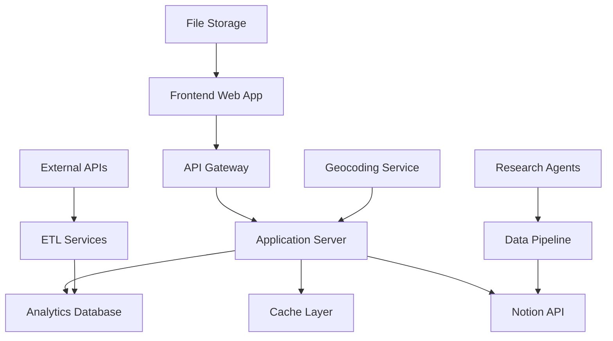

# 🏗️ Technical Architecture Specifications
*BC AI Ecosystem Atlas - Interactive Map & Dashboard System*

**Version**: 1.0  
**Created**: January 28, 2025  
**Status**: ✅ Phase 1 Complete

---

## 🎯 **System Overview**

### Architecture Goals
- **Scalability**: Support 1000+ organizations with sub-second response times
- **Real-time Sync**: Live updates from Notion database to map/dashboard
- **Developer Experience**: Clean APIs, comprehensive documentation, type safety
- **User Experience**: Instant search, smooth interactions, mobile-responsive
- **Data Integrity**: Robust validation, consistent state, audit trails

### Core Components


---

## 🗺️ **1. Interactive Map API Design**

### 1.1 Notion → Map Data Flow

#### Primary Data Pipeline
```typescript
interface NotionDataFlow {
  // 1. Real-time webhook listener
  notionWebhook: {
    endpoint: '/api/webhooks/notion',
    events: ['database.updated', 'page.created', 'page.updated'],
    authentication: 'bearer_token'
  },
  
  // 2. Data transformation layer
  transformer: {
    input: NotionPageResponse,
    output: MapOrganization,
    geocoding: GoogleMapsGeocodingAPI,
    validation: ZodSchema
  },
  
  // 3. Cache invalidation strategy
  cacheStrategy: {
    keys: ['org:{id}', 'region:{bc_region}', 'category:{category}'],
    ttl: 300, // 5 minutes
    invalidation: 'selective' // Only affected cache keys
  }
}
```

#### Organization Data Model
```typescript
interface MapOrganization {
  // Core identifiers
  id: string;                    // Notion page ID
  name: string;                  // Organization name
  slug: string;                  // URL-friendly name
  
  // Geographic data
  coordinates: {
    lat: number;
    lng: number;
    accuracy: 'ROOFTOP' | 'RANGE_INTERPOLATED' | 'GEOMETRIC_CENTER';
    geocoded_at: string;         // ISO timestamp
  };
  
  // Display information
  display: {
    category: CategoryEnum;
    ai_focus_areas: AIFocusArea[];
    size: SizeEnum;
    bc_region: BCRegionEnum;
    logo_url?: string;
    short_blurb: string;
  };
  
  // Contact information
  contact: {
    website?: string;
    email?: string;
    linkedin?: string;
    primary_contact?: string;
  };
  
  // Metadata
  metadata: {
    data_quality_score: number;   // 0-100
    last_updated: string;         // ISO timestamp
    data_sources: string[];
    completeness_percentage: number;
  };
}
```

### 1.2 Real-time Sync Architecture

#### WebSocket Implementation
```typescript
interface RealTimeSyncSystem {
  // Client connection management
  connections: {
    type: 'websocket',
    authentication: 'jwt_token',
    channels: ['map_updates', 'organization_changes'],
    heartbeat_interval: 30000
  },
  
  // Change detection and broadcasting
  changeDetection: {
    source: 'notion_webhooks',
    debounce: 2000,            // 2 second debounce
    batch_size: 10,            // Max changes per broadcast
    change_types: ['create', 'update', 'delete', 'geocoding_update']
  },
  
  // Conflict resolution
  conflictResolution: {
    strategy: 'last_writer_wins',
    versioning: true,
    audit_trail: true
  }
}
```

#### Performance Optimization Strategy
```typescript
interface PerformanceStrategy {
  // Data loading optimization
  dataLoading: {
    initial_load: {
      strategy: 'viewport_based',
      buffer_distance: '50km',
      max_organizations: 500
    },
    
    lazy_loading: {
      trigger: 'zoom_level_change',
      chunk_size: 100,
      prefetch_adjacent_regions: true
    }
  },
  
  // Clustering for high-density areas
  clustering: {
    enabled: true,
    min_zoom_for_individual_markers: 12,
    cluster_algorithms: 'supercluster',
    max_cluster_radius: 80
  },
  
  // Search optimization
  search: {
    indexing: 'elasticsearch',
    debounce: 300,
    max_results: 50,
    autocomplete: true,
    fuzzy_matching: true
  }
}
```

---

## 🗄️ **2. Database Optimization**

### 2.1 Analytics Database Schema

#### Core Tables
```sql
-- Organizations (optimized for analytics)
CREATE TABLE organizations (
    id UUID PRIMARY KEY,
    notion_page_id VARCHAR(255) UNIQUE NOT NULL,
    name VARCHAR(255) NOT NULL,
    slug VARCHAR(255) UNIQUE NOT NULL,
    
    -- Geographic data
    latitude DECIMAL(10, 8),
    longitude DECIMAL(11, 8),
    bc_region organization_region_enum,
    city VARCHAR(100),
    
    -- Classification
    category organization_category_enum,
    ai_focus_areas TEXT[], -- Array of AI focus areas
    size organization_size_enum,
    year_founded INTEGER,
    
    -- Contact information
    website TEXT,
    email VARCHAR(255),
    linkedin TEXT,
    
    -- Metadata
    data_quality_score INTEGER CHECK (data_quality_score >= 0 AND data_quality_score <= 100),
    completeness_percentage INTEGER CHECK (completeness_percentage >= 0 AND completeness_percentage <= 100),
    last_updated TIMESTAMP WITH TIME ZONE DEFAULT NOW(),
    created_at TIMESTAMP WITH TIME ZONE DEFAULT NOW()
);

-- Search optimization indexes
CREATE INDEX idx_organizations_geography ON organizations USING GIST (
    ST_MakePoint(longitude, latitude)
);

CREATE INDEX idx_organizations_search ON organizations USING GIN (
    to_tsvector('english', name || ' ' || COALESCE(short_blurb, ''))
);

CREATE INDEX idx_organizations_filters ON organizations (
    bc_region, category, size, year_founded
);

-- Materialized view for dashboard analytics
CREATE MATERIALIZED VIEW organization_analytics AS
SELECT 
    bc_region,
    category,
    size,
    EXTRACT(YEAR FROM created_at) as year_added,
    COUNT(*) as organization_count,
    AVG(data_quality_score) as avg_quality_score,
    AVG(completeness_percentage) as avg_completeness
FROM organizations 
GROUP BY ROLLUP(bc_region, category, size, EXTRACT(YEAR FROM created_at));
```

### 2.2 Search Index Optimization

#### Elasticsearch Configuration
```json
{
  "organizations_index": {
    "settings": {
      "number_of_shards": 2,
      "number_of_replicas": 1,
      "analysis": {
        "analyzer": {
          "organization_analyzer": {
            "type": "custom",
            "tokenizer": "standard",
            "filter": ["lowercase", "asciifolding", "synonym_filter"]
          }
        },
        "filter": {
          "synonym_filter": {
            "type": "synonym",
            "synonyms": [
              "AI,artificial intelligence,machine learning,ML",
              "startup,start-up,scale-up,scaleup",
              "Vancouver,YVR,Metro Vancouver,Lower Mainland"
            ]
          }
        }
      }
    },
    "mappings": {
      "properties": {
        "name": {
          "type": "text",
          "analyzer": "organization_analyzer",
          "fields": {
            "keyword": {"type": "keyword"},
            "suggest": {"type": "completion"}
          }
        },
        "ai_focus_areas": {
          "type": "keyword"
        },
        "location": {
          "type": "geo_point"
        },
        "category": {
          "type": "keyword"
        },
        "suggest": {
          "type": "completion",
          "contexts": [
            {"name": "category", "type": "category"},
            {"name": "region", "type": "category"}
          ]
        }
      }
    }
  }
}
```

---

## 🚀 **3. API Specifications**

### 3.1 RESTful Endpoint Design

#### Core Organization Endpoints
```typescript
// GET /api/v1/organizations
interface GetOrganizationsQuery {
  // Filtering
  bc_region?: BCRegionEnum[];
  category?: CategoryEnum[];
  ai_focus_areas?: string[];
  size?: SizeEnum[];
  year_founded_min?: number;
  year_founded_max?: number;
  
  // Geographic filtering
  bounds?: {
    north: number;
    south: number;
    east: number;
    west: number;
  };
  center?: {
    lat: number;
    lng: number;
    radius_km: number;
  };
  
  // Search
  search?: string;
  
  // Pagination
  page?: number;
  per_page?: number; // Max 100
  
  // Data selection
  fields?: string[]; // Sparse fieldsets
  include_metadata?: boolean;
}

interface GetOrganizationsResponse {
  data: MapOrganization[];
  meta: {
    total_count: number;
    page: number;
    per_page: number;
    has_next_page: boolean;
    total_pages: number;
  };
  links: {
    self: string;
    next?: string;
    prev?: string;
  };
}

// GET /api/v1/organizations/:id
interface GetOrganizationResponse {
  data: MapOrganization;
  related?: {
    nearby_organizations: MapOrganization[];
    similar_organizations: MapOrganization[];
  };
}

// GET /api/v1/organizations/search/suggest
interface SearchSuggestQuery {
  q: string;
  limit?: number; // Default 10, max 25
  contexts?: {
    category?: string[];
    region?: string[];
  };
}

interface SearchSuggestResponse {
  suggestions: Array<{
    text: string;
    score: number;
    category?: string;
    type: 'organization' | 'category' | 'ai_focus_area' | 'location';
  }>;
}
```

#### Analytics Endpoints
```typescript
// GET /api/v1/analytics/overview
interface AnalyticsOverviewResponse {
  ecosystem_metrics: {
    total_organizations: number;
    by_region: Record<BCRegionEnum, number>;
    by_category: Record<CategoryEnum, number>;
    by_ai_focus: Record<string, number>;
    data_quality_score: number;
    last_updated: string;
  };
  
  growth_metrics: {
    organizations_added_this_month: number;
    organizations_added_this_year: number;
    growth_rate_monthly: number;
    founding_year_distribution: Record<string, number>;
  };
  
  geographic_distribution: {
    density_by_region: Array<{
      region: BCRegionEnum;
      organization_count: number;
      density_per_100k_population: number;
    }>;
  };
}

// GET /api/v1/analytics/trends
interface TrendsQuery {
  metric: 'organization_count' | 'funding_events' | 'data_quality';
  time_period: 'monthly' | 'quarterly' | 'yearly';
  start_date?: string;
  end_date?: string;
  group_by?: 'region' | 'category' | 'ai_focus_area';
}
```

### 3.2 GraphQL Schema

#### Core Schema Definition
```graphql
type Organization {
  id: ID!
  notionPageId: String!
  name: String!
  slug: String!
  
  # Geographic data
  coordinates: Coordinates
  bcRegion: BCRegion!
  city: String
  
  # Classification
  category: OrganizationCategory!
  aiFocusAreas: [AIFocusArea!]!
  size: OrganizationSize
  yearFounded: Int
  
  # Contact information
  website: String
  email: String
  linkedin: String
  primaryContact: String
  
  # Display data
  logoUrl: String
  shortBlurb: String
  
  # Metadata
  dataQualityScore: Int!
  completenessPercentage: Int!
  lastUpdated: DateTime!
  createdAt: DateTime!
  
  # Relationships
  nearbyOrganizations(radius: Float = 10.0): [Organization!]!
  similarOrganizations(limit: Int = 5): [Organization!]!
}

type Query {
  # Single organization
  organization(id: ID, slug: String): Organization
  
  # Multiple organizations with filtering
  organizations(
    filter: OrganizationFilter
    search: String
    bounds: GeographicBounds
    pagination: PaginationInput
  ): OrganizationConnection!
  
  # Search and suggestions
  searchSuggestions(
    query: String!
    limit: Int = 10
    contexts: SearchContexts
  ): [SearchSuggestion!]!
  
  # Analytics
  ecosystemAnalytics: EcosystemAnalytics!
  trendsAnalysis(input: TrendsInput!): [TrendDataPoint!]!
}

type Mutation {
  # Update organization (for claimed organizations)
  updateOrganization(
    id: ID!
    input: OrganizationUpdateInput!
  ): Organization!
  
  # Report data issues
  reportDataIssue(
    organizationId: ID!
    issue: DataIssueInput!
  ): DataIssueReport!
}

type Subscription {
  # Real-time updates
  organizationUpdates(
    organizationIds: [ID!]
    regions: [BCRegion!]
  ): OrganizationUpdate!
  
  # Ecosystem metrics updates
  ecosystemMetricsUpdates: EcosystemAnalytics!
}
```

### 3.3 Authentication & Rate Limiting

#### API Access Control
```typescript
interface APIAccessControl {
  // Public access (rate limited)
  public: {
    endpoints: [
      '/api/v1/organizations',
      '/api/v1/organizations/:id',
      '/api/v1/analytics/overview'
    ],
    rate_limit: {
      requests_per_minute: 60,
      requests_per_hour: 1000,
      burst_capacity: 100
    }
  },
  
  // Authenticated access
  authenticated: {
    required_for: [
      '/api/v1/organizations/search/suggest',
      '/api/v1/analytics/trends',
      'GraphQL mutations'
    ],
    authentication: 'JWT' | 'API_key',
    rate_limit: {
      requests_per_minute: 300,
      requests_per_hour: 5000
    }
  },
  
  // Organization owners (claimed profiles)
  organization_owners: {
    permissions: ['update_own_organization', 'view_analytics'],
    verification_required: true
  },
  
  // Admin access
  admin: {
    permissions: ['full_access', 'user_management', 'system_analytics'],
    mfa_required: true
  }
}
```

---

## 📊 **4. Caching Strategy**

### 4.1 Multi-Layer Caching

#### Cache Architecture
```typescript
interface CacheArchitecture {
  // CDN layer (Cloudflare/AWS CloudFront)
  cdn: {
    static_assets: {
      ttl: '1 year',
      cache_control: 'public, immutable'
    },
    api_responses: {
      ttl: '5 minutes',
      cache_control: 'public, max-age=300',
      purge_strategy: 'tag_based'
    }
  },
  
  // Application cache (Redis)
  application: {
    organization_data: {
      key_pattern: 'org:{id}',
      ttl: 300, // 5 minutes
      invalidation: 'webhook_triggered'
    },
    
    search_results: {
      key_pattern: 'search:{hash}',
      ttl: 180, // 3 minutes
      max_memory: '1GB'
    },
    
    analytics: {
      key_pattern: 'analytics:{type}:{period}',
      ttl: 1800, // 30 minutes
      computation_intensive: true
    }
  },
  
  // Database query cache
  database: {
    materialized_views: {
      refresh_strategy: 'incremental',
      refresh_frequency: '15 minutes'
    },
    
    query_cache: {
      enabled: true,
      size: '256MB',
      ttl: 600 // 10 minutes
    }
  }
}
```

### 4.2 Cache Invalidation Strategy

#### Intelligent Invalidation
```typescript
interface CacheInvalidationStrategy {
  // Webhook-based invalidation
  notion_webhooks: {
    organization_updated: [
      'org:{organization_id}',
      'region:{bc_region}',
      'category:{category}',
      'search:*', // Invalidate all search caches
      'analytics:overview'
    ]
  },
  
  // Time-based invalidation
  scheduled: {
    analytics_refresh: {
      cron: '0 */15 * * * *', // Every 15 minutes
      targets: ['analytics:*']
    },
    
    search_index_rebuild: {
      cron: '0 0 2 * * *', // Daily at 2 AM
      targets: ['search:*']
    }
  },
  
  // Manual invalidation
  admin_tools: {
    cache_management_ui: true,
    selective_purging: true,
    performance_monitoring: true
  }
}
```

---

## 🔄 **5. Deployment Architecture**

### 5.1 Infrastructure as Code

#### Docker Configuration
```dockerfile
# Multi-stage build for optimization
FROM node:18-alpine AS builder
WORKDIR /app
COPY package*.json ./
RUN npm ci --only=production

FROM node:18-alpine AS runtime
WORKDIR /app
COPY --from=builder /app/node_modules ./node_modules
COPY . .
EXPOSE 3000
CMD ["npm", "start"]
```

#### Kubernetes Deployment
```yaml
apiVersion: apps/v1
kind: Deployment
metadata:
  name: bc-ai-ecosystem-api
spec:
  replicas: 3
  selector:
    matchLabels:
      app: bc-ai-ecosystem-api
  template:
    metadata:
      labels:
        app: bc-ai-ecosystem-api
    spec:
      containers:
      - name: api
        image: bc-ai-ecosystem-api:latest
        ports:
        - containerPort: 3000
        env:
        - name: NODE_ENV
          value: "production"
        - name: DATABASE_URL
          valueFrom:
            secretKeyRef:
              name: database-secret
              key: url
        resources:
          requests:
            memory: "256Mi"
            cpu: "250m"
          limits:
            memory: "512Mi"
            cpu: "500m"
        readinessProbe:
          httpGet:
            path: /health
            port: 3000
          initialDelaySeconds: 10
          periodSeconds: 5
        livenessProbe:
          httpGet:
            path: /health
            port: 3000
          initialDelaySeconds: 30
          periodSeconds: 10
```

### 5.2 Monitoring & Observability

#### Health Monitoring
```typescript
interface MonitoringStack {
  // Application performance monitoring
  apm: {
    service: 'New Relic' | 'DataDog',
    metrics: [
      'response_time',
      'error_rate',
      'throughput',
      'database_query_time',
      'cache_hit_rate'
    ]
  },
  
  // Infrastructure monitoring
  infrastructure: {
    cpu_usage: { threshold: 80, alert: true },
    memory_usage: { threshold: 85, alert: true },
    disk_usage: { threshold: 90, alert: true },
    network_latency: { threshold: 100, unit: 'ms' }
  },
  
  // Business metrics
  business_metrics: {
    api_usage: 'track_per_endpoint',
    user_engagement: 'track_session_duration',
    data_quality: 'monitor_completion_scores',
    search_effectiveness: 'track_click_through_rates'
  },
  
  // Alerting
  alerts: {
    channels: ['slack', 'email', 'pagerduty'],
    escalation_policy: true,
    maintenance_windows: true
  }
}
```

---

## 📋 **Implementation Checklist**

### Phase 1A: Foundation (Week 1-2)
- [ ] Set up development environment with Docker
- [ ] Implement basic REST API with Express/Fastify
- [ ] Set up PostgreSQL database with optimized schema
- [ ] Configure Redis caching layer
- [ ] Implement Notion API integration

### Phase 1B: Core Features (Week 3-4)
- [ ] Build organization CRUD operations
- [ ] Implement geographic search with PostGIS
- [ ] Set up Elasticsearch for full-text search
- [ ] Create real-time WebSocket infrastructure
- [ ] Build automated geocoding pipeline

### Phase 1C: Performance & Scaling (Week 5-6)
- [ ] Implement intelligent caching strategy
- [ ] Set up CDN and edge caching
- [ ] Configure monitoring and alerting
- [ ] Load testing and optimization
- [ ] Documentation and API reference

---

## 🎯 **Success Metrics**

### Performance Targets
- **API Response Time**: < 200ms (95th percentile)
- **Map Load Time**: < 2 seconds for 500 organizations
- **Search Response**: < 100ms for autocomplete
- **Real-time Updates**: < 5 seconds from Notion to map
- **Uptime**: 99.9% availability

### Data Quality Targets
- **Geocoding Accuracy**: > 95% ROOFTOP or RANGE_INTERPOLATED
- **Cache Hit Rate**: > 85% for frequently accessed data
- **Search Relevance**: > 90% user satisfaction (click-through)
- **Data Freshness**: < 5 minutes lag from Notion updates

---

*Technical Architecture Phase 1 Complete ✅*  
*Next: Phase 2 - Data Pipeline Automation* 